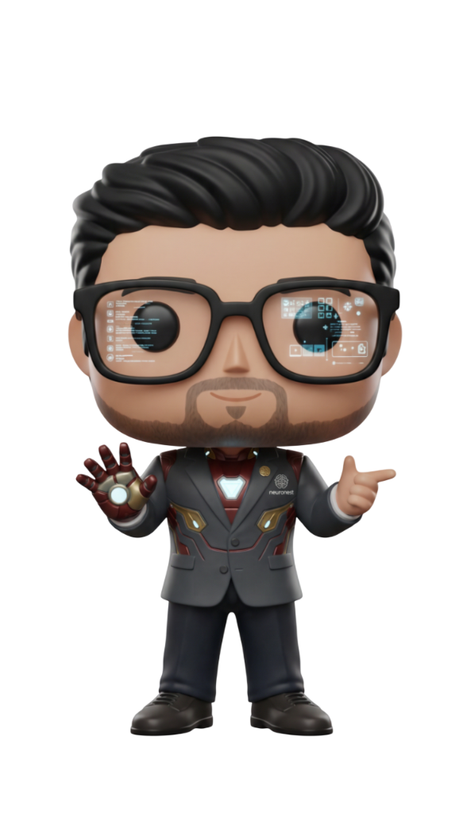

# 🌐 **3D Interactive Portfolio**

> *Architecting Digital Futures with React, Three.js, and Framer Motion.*



<div align="center">

[](https://reactjs.org/)
[](https://www.typescriptlang.org/)
[](https://vitejs.dev/)
[](https://www.framer.com/motion/)
[](https://tailwindcss.com/)

[**Live Demo**](#) · [**Report Bug**](#) · [**Request Feature**](#)

</div>

---

## 🚀 **Mission Brief**

Welcome to my digital headquarters. This portfolio isn't just a showcase; it's an immersive experience designed to bridge the gap between **high-performance engineering** and **cinematic aesthetics**. 

Built with a focus on **User Experience (UX)** and **micro-interactions**, every scroll, click, and hover tells a story of innovation.

## ✨ **Key Features**

*   **🏆 3D Vinyl Mascot Identity:** A unique, consistent character guide throughout the journey.
*   **🎥 Cinematic Hero Section:** Parallax effects, glitch animations, and deep visual layering.
*   **🕹️ Interactive Projects Archive:** A chronological timeline of digital artifacts.
*   **⚡ Premium Hackathon Gallery:** 3D tilt cards showcasing competitive achievements.
*   **🎨 Glassmorphism & Neon UI:** Modern, dark-mode aesthetic with vibrant accents.
*   **📱 Fully Responsive:** Optimized for all devices, from desktop command centers to mobile units.

## 🛠️ **Tech Stack & Arsenal**

| Domain | Technologies |
| :--- | :--- |
| **Core** | React 18, TypeScript, Vite |
| **Animation** | Framer Motion, GSAP (Concepts) |
| **Styling** | CSS Modules, Tailwind CSS |
| **3D Elements** | Three.js (Concepts), Spline (Assets) |
| **Icons** | Lucide React |

## 📦 **Installation & Deployment**

Initialize the project locally to explore the code:

```bash
# 1. Clone the repository
git clone https://github.com/ItzHimanshu007/3d_portfolio_website.git

# 2. Navigate to the mission directory
cd 3d_portfolio_website

# 3. Install dependencies
npm install

# 4. Ignite the development server
npm run dev
```

## 📂 **Project Structure**

```
src/
├── components/   # Reusable UI modules (Hero, Navbar, etc.)
├── pages/        # Route views (Home, Archive, Details)
├── data/         # Static content and configuration
└── assets/       # Images and media resources
```

## 🤝 **Connect with Me**

Ready to build something extraordinary?

*   **LinkedIn:** [Himanshu Jasoriya](https://www.linkedin.com/in/himanshu-jasoriya-1548a0215/)
*   **GitHub:** [ItzHimanshu007](https://github.com/ItzHimanshu007)
*   **Email:** [Contact via Portfolio](#contact)

---

<div align="center">

*Crafted with 💻 and ☕ by Himanshu Jasoriya. © 2025*

</div>
